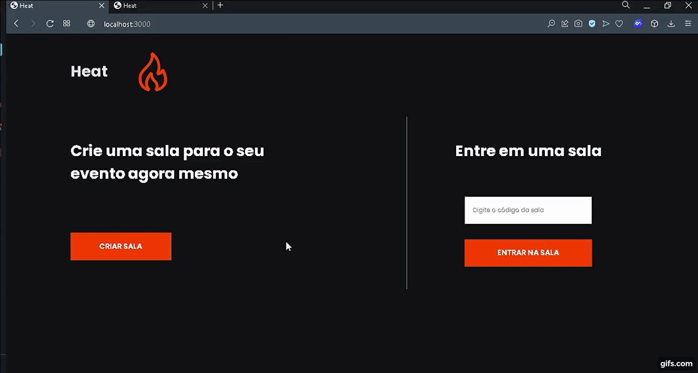
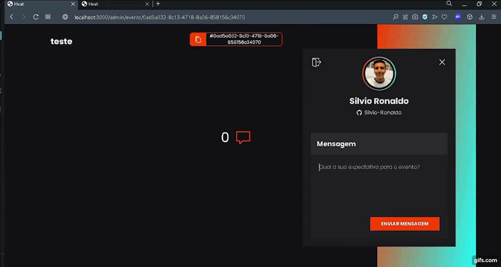

<h1 align="center">
  Heat 🔥
</h1>

  <strong>
    🔥 Create rooms for your events and monitor the crowd's excitement with Heat 🔥 
  </strong>Practical project for study 

  
  
  
  
  

<h2>
  📋 Table of contents
</h2>
<ul>
  <li><a href="https://github.com/Silvio-Ronaldo/Heat#-how-it-works">How it works</a></li>
  <li><a href="https://github.com/Silvio-Ronaldo/Heat#%EF%B8%8F-demonstration">Demonstration</a></li>
  <li><a href="https://github.com/Silvio-Ronaldo/Heat#-upcoming-features">Upcoming features</a></li>
  <li><a href="https://github.com/Silvio-Ronaldo/Heat#%EF%B8%8F-running-locally">Running locally</a></li>
  <li><a href="https://github.com/Silvio-Ronaldo/Heat#%EF%B8%8F-technologies">Technologies</a></li>
  <li><a href="https://github.com/Silvio-Ronaldo/Heat#-author">Author</a></li>
  <li><a href="https://github.com/Silvio-Ronaldo/Heat#%EF%B8%8F-license">License</a></li>
</ul> 

<h2>🤔 How it works</h2>

Are you going to organize an event and want to stimulate the crowd's excitement? Just create a room in Heat!

Create a custom room for your event and make the code available to everyone and you're done.

With the code, anyone can enter the room and say what's waiting for your event.
 

<h2>🖥️ Demonstration</h2>
<h3>Web</h3>
  

    
  
 
  
  

    
  
 

  

<h2>📆 Upcoming features</h2>

New screens in mobile app to support new backend features
 

<h2>🕹️ Running locally</h2>
<h3>Prerequisites</h3>
<ol>
  <li><strong>Installing Git:</strong> You need to have Git on your machine to perform a few steps. To download Git, click <a href="https://git-scm.com/downloads">here.</a></li> 
  <li><strong>Installing Node:</strong> To run the server you will need Node.js, to download it, click <a href="https://nodejs.org/en/">here.</a></strong></li> 
  <li><strong>Installing Expo:</strong> To run the mobile, you need to install the Expo, click <a href="https://docs.expo.io/get-started/installation/">here.</a></li> 
  <li><strong>Installing Yarn 1:</strong> Yarn is a package manager that you can download directly from the website by clicking <a href="https://classic.yarnpkg.com/en/docs/install#windows-stable">here.</a> If you prefer, use the NPM.</li> 
  <li><strong>Code Editor (optional):</strong> Make sure you have a code editor of your choice. I recommend using the VS Code. If you need to, download it <a href="https://code.visualstudio.com/Download">here.</a></li>
</ol> 

<h3>🎲 Running the backend server</h3>
<ol>
  <li>In a terminal, clone this repository:
    
<code>git clone https://github.com/Silvio-Ronaldo/Heat.git</code>

  </li>
  <li>Enter the project folder:
    
<code>cd Heat</code>

  </li>
  <li>Enter the server folder:
    
<code>cd heat-api</code>

  </li>
  <li>Install all dependencies:
    
<code>yarn install</code> or <code>yarn</code>

  </li>
  <li>Start the SQLite database with all migrations using Prisma:
    
<code>yarn prisma migrate dev</code>

  </li>
  <li>Start the development server:
    
<code>yarn dev</code>

  </li>
  <li>After these steps, the server should start at the <strong>3333</strong> port.</li>
</ol> 

<h3>⚛️ Running the React app with Vite</h3>
<ol>
  <li>If you have already cloned the repository, open in another terminal window, otherwise, see first step in 'Running the backend server'.</li>
  <li>Enter the project folder:
    
<code>cd Heat</code>

  </li>
  <li>Enter the web folder:
    
<code>cd heat-web</code>

  </li>
  <li>Install all dependencies:
    
<code>yarn install</code> or <code>yarn</code>

  </li>
  <li>Start the web development server:
    
<code>yarn dev</code>

  </li>
  <li>After these steps, the server should start at the <strong>3000</strong> port, open the browser and access <a href="http://localhost:3000">http://localhost:3000</a>.</li>
</ol> 

<h3>📱 Running the Mobile app</h3>
<ol>
  <li>With the Expo installed, according to the documentation, follow. Otherwise, see first step in 'Running the backend server'.</li>
  <li>Enter the project folder:
    
<code>cd Heat</code>

  </li>
  <li>Enter the mobile folder:
    
<code>cd heat-app</code>

  </li>
  <li>Install all dependencies:
    
<code>yarn install</code> or <code>yarn</code>

  </li>
  <li>Start the mobile development server:
    
<code>yarn start</code>

  </li>
  <li>After these steps, the mobile application must start on your emulator or on your device, according to your choice.</li>
</ol> 

<h3>😼 Configuring OAuth App on Github</h3>
<ol>
  <li>To login with Github, you need to create an OAuth App. To do this, click on your user's avatar in the upper-right corner.</li>
  <li>Select Settings. Then, in the left menu click on Developer Settings.</li>
  <li>Click on OAuth Apps and create a new app.</li>
  <li>Enter the name and description you want.</li>
  <li>In Homepage URL, type: http://localhost:3333</li>
  <li>In Authorization Callback URL, type: http://localhost:3000/loading</li>
  <li>That's it, you've set up an OAuth App.</li>
</ol> 

<h3>🧷 Connecting your OAuth App to Heat</h3>
<ol>
  <li>IMPORTANT: Go to the heat-web directory and within src/contexts/auth.tsx replace the constant value of GITHUB_CLIENT_ID with the Client ID value of your newly created OAuth App.</li>
  <li>IMPORTANT: Go to the heat-api directory and enter the .env.example file. Rename the file to .env</li>
  <li>IMPORTANT: Add your OAuth App's Client ID and Client Secret credentials to GITHUB_CLIENT_ID and GITHUB_CLIENT_SECRET, respectively.</li>
  <li>IMPORTANT: Go to a hash generator site like <a href="https://www.md5hashgenerator.com">MD5</a> for example and generate a random hash. Add the hash to JWT_SECRET.</li>
</ol> 

<h2>🛡️ Technologies</h2>

The main tools used in the development of the Heat:

<ul>
  <li><a href="https://pt-br.reactjs.org">React</a></li>
  <li><a href="https://vitejs.dev">Vite</a></li>
  <li><a href="https://www.typescriptlang.org">TypeScript</a></li>
  <li><a href="https://styled-components.com">Styled Components</a></li> 
  
  <li><a href="https://nodejs.org/en/">Node</a></li>
  <li><a href="https://www.prisma.io">Prisma</a></li>
  <li><a href="https://socket.io">socket.io</a></li> 
  
  <li><a href="https://reactnative.dev">React Native</a></li>
  <li><a href="https://expo.dev">Expo</a></li> 
  
  <li><a href="https://elixir-lang.org">Elixir</a></li> 
</ul> 

<h2>👽 Author</h2>
<table>
  <tr>
    <td align="center"><a href="https://github.com/Silvio-Ronaldo"> <b>Silvio Ronaldo</b></a> <a href="https://github.com/Silvio-Ronaldo" title="Silvio Ronaldo">🍀</a></td>
  </tr>
</table>

Leave your star, fork the project or open a pull request ❤️

Contact me on social networks: 

 

<h2>⚖️ License</h2>

<strong>Heat is MIT licensed, as found in the <a href="./LICENSE">LICENSE file</a>.</strong>

